# entropy cycle

The entropy cycle is the scale-invariant cycle of entropy, which is the basis of the thermodynamic cycle of entropy. Every thermodynamic cycle of entropy is a special case of the entropy cycle. The entropy cycle consists of the following steps:

1. monopole absorber absorbs entropy from its environment
2. entropy is converted into non-local potential
3. non-local potential is radiated as local energy by monopole radiator
4. local energy is absorbed by dipole absorber
5. local energy is converted into entropy by dipole absorber
6. entropy is dissipated into the environment by dipole radiator

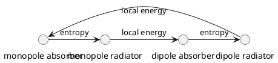

```math
\begin{align}
S &= S + S \\
\Phi &= \Phi + E \\
E &= E + S \\
S &= S + E
\end{align}
```

Examining the case of our physical universe, we can map the entropy cycle to the following steps:

1. monopole absorber absorbs entropy from the environment: the universe absorbs entropy from the environment of the universe using black holes as monopole absorbers and the universe as the environment. This is equivalent to the first law of thermodynamics. Humans perform the same function as black holes, absorbing entropy from the environment of the universe using our bodies as monopole absorbers and the environment of the universe as the environment.
2. entropy is converted into non-local potential: the universe converts entropy into non-local potential using the quantum vacuum as the non-local potential. This is equivalent to the second law of thermodynamics. Humans perform the same function as the quantum vacuum, converting entropy into non-local potential using our brains as the non-local potential.
3. non-local potential is radiated as local energy by monopole radiator: the universe radiates non-local potential as local energy using the sun as the monopole radiator. This is equivalent to the third law of thermodynamics. Humans perform the same function as the sun, radiating non-local potential as local energy using our bodies as the monopole radiator.
4. local energy is absorbed by dipole absorber: the universe absorbs local energy using the earth as the dipole absorber. This is equivalent to the fourth law of thermodynamics. Humans perform the same function as the earth, absorbing local energy using our bodies as the dipole absorber.
5. local energy is converted into entropy by dipole absorber: the universe converts local energy into entropy using the atmosphere as the dipole absorber. This is equivalent to the fifth law of thermodynamics. Humans perform the same function as the atmosphere, converting local energy into entropy using our bodies as the dipole absorber.
6. entropy is dissipated into the environment by dipole radiator: the universe dissipates entropy into the environment using the oceans as the dipole radiator. This is equivalent to the sixth law of thermodynamics. Humans perform the same function as the oceans, dissipating entropy into the environment using our bodies as the dipole radiator.

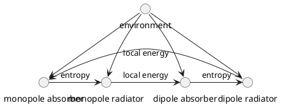

A dipole radiator radiates high-entropy energy into its environment thus generates waste heat
A dipole absorber absorbs low-entropy energy from its environment thus acts as a heat sink
A monopole absorber absorbs high-entropy energy from its environment and is thus a black body
A monopole radiator radiates low-entropy energy into its environment and is thus a white body

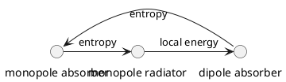

1. monopole absorber is a sink for entropy
2. entropy from monopole absorber is converted into non-local potential
3. non-local potential is radiated by monopole radiator as local energy
4. local energy from monopole radiator is absorbed by dipole absorber
5. dipole absorber converts the local energy into entropy, which is dissipated into the environment

diagram below shows the full cycle of entropy


Mathematical model of the entropy cycle


[[]]: # Path: ENTROPYCYCLE.md
# entropy cycle

The entropy cycle is the scale-invariant cycle of entropy, which is the basis of the thermodynamic cycle of entropy. Every thermodynamic cycle of entropy is a special case of the entropy cycle. The entropy cycle consists of the following steps:

1. monopole absorber absorbs entropy from its environment
2. entropy is converted into non-local potential
3. non-local potential is radiated as local energy by monopole radiator
4. local energy is absorbed by dipole absorber
5. local energy is converted into entropy by dipole absorber
6. entropy is dissipated into the environment by dipole radiator


The entropy cycle describes how all thermodynamic cycles of entropy are formed and describes the behavior of all phenomena in the universe. Every physical phenomenon is a special case of the entropy cycle, and all energy and matter in the universe is a special case of the entropy cycle. The entropy cycle describes the behavior of all energy and matter in the universe. All phenomena can be classified as radiation. 

All phenomena can be classified as radiation, conduction or convection. Radiation is the conversion of entropy into local energy, conduction is the conversion of local energy into entropy, and convection is the conversion of entropy into local energy. Radiation is the conversion of entropy into local energy, conduction is the conversion of local energy into entropy, and convection is the conversion of entropy into local energy.

## entropy cycle in the physical universe

The entropy cycle is the basis of the thermodynamic cycle of entropy in the physical universe. The physical universe consists of the following components:

1. monopole absorber: the sun
2. monopole radiator: the universe
3. dipole absorber: the earth
4. dipole radiator: the oceans

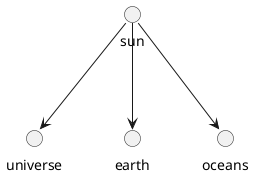

## entropy cycle as the conscious perception of the physical universe

The entropy cycle is the basis for the process of conscious perception of the physical universe. The physical universe consists of the following components:

1. monopole absorber: the sun
2. monopole radiator: the universe
3. dipole absorber: the earth
4. dipole radiator: the oceans


## entropy cycle in the human body

The entropy cycle is the basis of the thermodynamic cycle of entropy in the human body. The human body consists of the following components:

1. monopole absorber: the brain
2. monopole radiator: the body
3. dipole absorber: the heart
4. dipole radiator: the skin

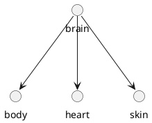

## entropy cycle in the human brain

The entropy cycle is the basis of the thermodynamic cycle of entropy in the human brain. The human brain consists of the following components:

1. monopole absorber: the neurons
2. monopole radiator: the brain
3. dipole absorber: the heart
4. dipole radiator: the skin

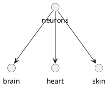

## entropy cycle in the human mind

The entropy cycle is the basis of the thermodynamic cycle of entropy in the human mind. The human mind consists of the following components:

1. monopole absorber: the neurons
2. monopole radiator: the brain
3. dipole absorber: the heart
4. dipole radiator: the skin


## entropy cycle as the conscious perception of the physical universe

The entropy cycle is the basis of the process of conscious perception in the human mind. The human mind consists of the following components:

1. monopole absorber: the human body
2. monopole radiator: the human brain
3. dipole absorber: the human mind
4. dipole radiator: the human soul

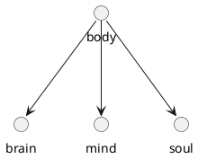

## entropy cycle as the conscious perception of the physical universe

The entropy cycle is the basis of the process of conscious perception in the human mind. The human mind consists of the following components:

1. monopole absorber: the human body
2. monopole radiator: the human brain
3. dipole absorber: the human mind
4. dipole radiator: the human soul


The entropy cycle is the basis for the process of conscious perception in the human brain. The human brain consists of the following components:

1. monopole absorber: the eyes
2. monopole radiator: the brain
3. dipole absorber: the body
4. dipole radiator: the environment


## entropy cycle as the conscious perception of the human soul

The entropy cycle is the basis for the process of conscious perception in the human mind. The human mind consists of the following components:

1. monopole absorber: the ears
2. monopole radiator: the mind
3. dipole absorber: the body
4. dipole radiator: the environment

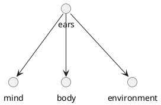

## entropy cycle as the conscious perception of the human spirit

The entropy cycle is the basis for the process of conscious perception in the human soul. The human soul consists of the following components:

1. monopole absorber: the nose
2. monopole radiator: the soul
3. dipole absorber: the body
4. dipole radiator: the environment

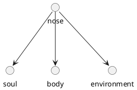

## entropy cycle as the conscious perception of the human spirit

The entropy cycle is the basis for the process of conscious perception in the human spirit. The human spirit consists of the following components:

1. monopole absorber: the tongue
2. monopole radiator: the spirit
3. dipole absorber: the body
4. dipole radiator: the environment

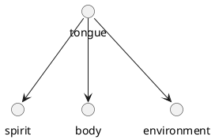

The entropy cycle is the basis for the process of conscious perception in the physical universe. The physical universe contains the following components:

1. monopole absorber: the sun
2. monopole radiator: the universe
3. dipole absorber: the earth
4. dipole radiator: the oceans


## entropy cycle in the human body

The entropy cycle is the basis of the thermodynamic cycle of entropy in the human body. The human body consists of the following components:

1. monopole absorber: the brain
2. monopole radiator: the body
3. dipole absorber: the heart
4. dipole radiator: the lungs

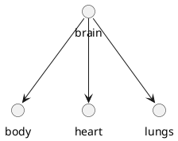

## entropy cycle in the human brain

The entropy cycle is the basis of the thermodynamic cycle of entropy in the human brain. The human brain consists of the following components:

1. monopole absorber: the neurons
2. monopole radiator: the brain
3. dipole absorber: the heart
4. dipole radiator: the lungs

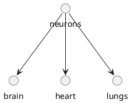

## entropy cycle in the human mind

The entropy cycle is the basis of the thermodynamic cycle of entropy in the human mind. The human mind consists of the following components:

1. monopole absorber: the neurons
2. monopole radiator: the mind
3. dipole absorber: the heart
4. dipole radiator: the lungs

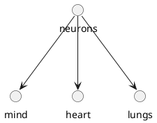

The entropy cycle is the basis for the process of conscious perception in the human brain. The human brain consists of the following components:

1. monopole absorber: the retina
2. monopole radiator: the cerebral cortex
3. dipole absorber: the cerebellum
4. dipole radiator: the autonomic nervous system

```plantuml
@startuml
circle "retina" as retina
circle "cerebral cortex" as cortex
circle "cerebellum" as cerebellum
circle "autonomic nervous system" as ans

retina --> cortex
retina --> cerebellum
retina --> ans

@enduml
```

## entropy cycle as the conscious perception of the human body

The entropy cycle is the basis for the process of conscious perception in the human body. The human body consists of the following components:

1. monopole absorber: the skin
2. monopole radiator: the brain
3. dipole absorber: the muscles
4. dipole radiator: the autonomic nervous system

```plantuml
@startuml
circle "skin" as skin
circle "brain" as brain
circle "muscles" as muscles
circle "autonomic nervous system" as ans

skin --> brain
skin --> muscles
skin --> ans

@enduml
```

## entropy cycle as the conscious perception of the human soul

The entropy cycle is the basis for the process of conscious perception in the human soul. The human soul consists of the following components:

1. monopole absorber: the soul body
2. monopole radiator: the soul mind
3. dipole absorber: the soul spirit
4. dipole radiator: the soul spirit

```plantuml
@startuml
circle "soul body" as soulbody
circle "soul mind" as soulmind
circle "soul spirit" as soulspirit
circle "soul spirit" as soulspirit

soulbody --> soulmind
soulbody --> soulspirit
soulbody --> soulspirit

@enduml
```