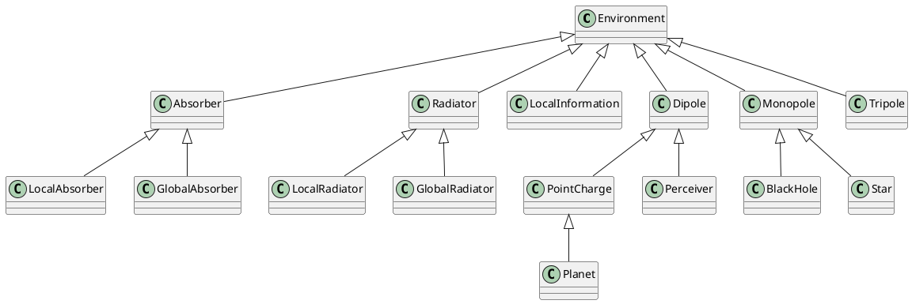
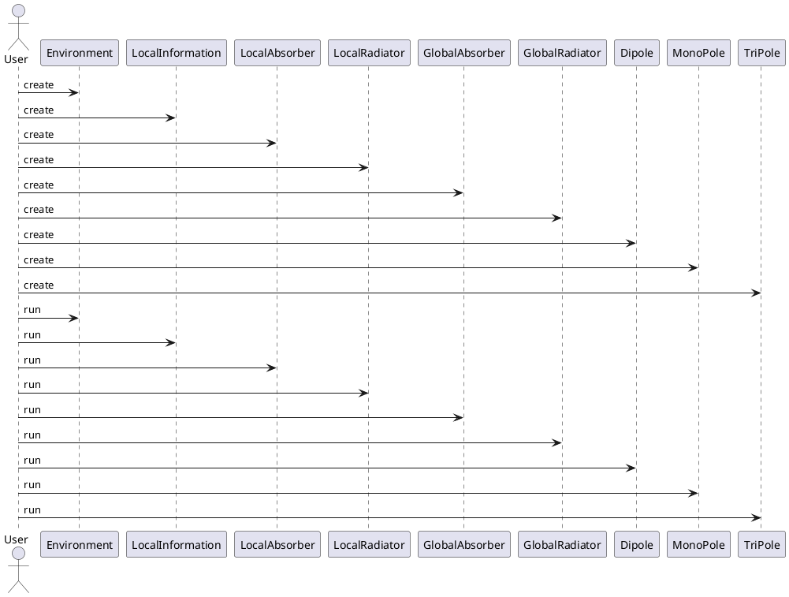
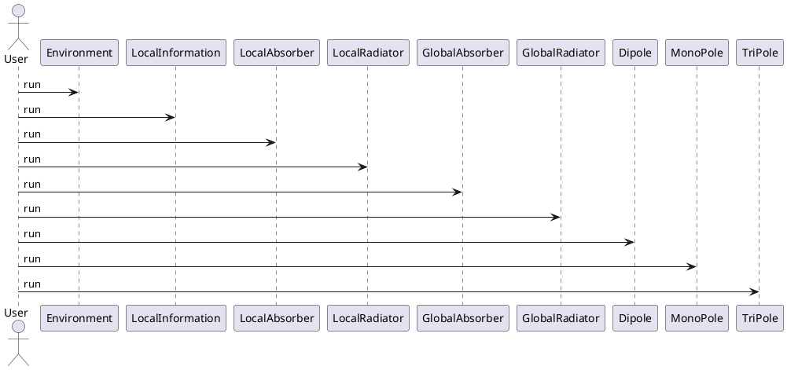

# Entropy Cycle simulation

## summary

This project implements a simulation of the entropy cycle in a quantum mechanical system. 

## components

The simulation includes the following components:

* Environment
* LocalInformation
* LocalAbsorber
* LocalRadiator
* GlobalAbsorber
* GlobalRadiator
* Dipole
* MonoPole
* TriPole

## entropy cycle

### definition

The entropy cycle is defined by the following equations:

1. entropy = entropy + entropy
2. non-local potential = non-local potential + local energy
3. local energy = local energy + entropy
4. entropy = entropy + local energy

### mathematical formula

Written as a mathematical formula:
$$ \begin{align} S &= S + S \\ \Phi &= \Phi + E \\ E &= E + S \\ S &= S + E \end{align} $$

## class hierarchy

class hierarchy:

## sequence diagram

### creating the simulation

sequence diagram:

### simluation steps

sequence diagram:

